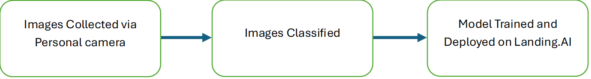

# Face Position

Landing.AI Model for Face Position Prediction using Classification

## Authors

- [@Guryansh](https://www.github.com/Guryansh)


## Features

- Distinguishes Count of Fingers in One, Two, Three
- Supports multiple image formats jpeg, jpg, png


## Methodology



## Description

- Number of Images= 14 (One=5, Two=4, Three=5)
- Can test multiple using script in index.py

## Usage
- Give folder name in image_folder
- Result filename in output_csv
```bash
image_folder = <folderName>
output_csv = <resultCSV>
```

## Example
```python
image_folder = "images"
output_csv = "predictions.csv"
```

## Live link
https://app.landing.ai/predict/d7f22c01-5d7a-4dc7-b2c5-96999bc7d2ed


[](https://choosealicense.com/licenses/mit/)


